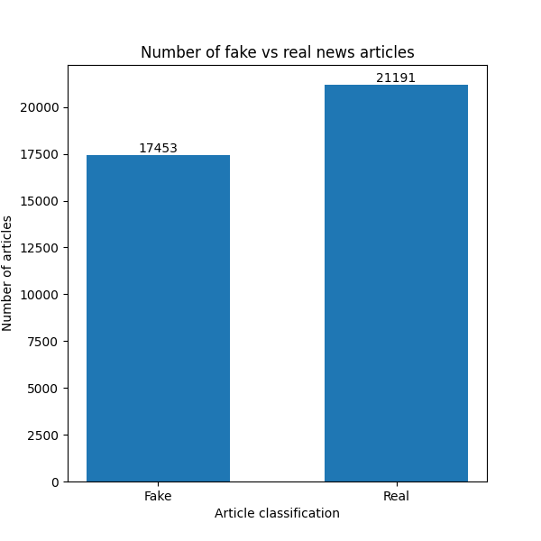

# The Dataset

### Fake News detection dataset
The dataset can be found at: https://www.kaggle.com/datasets/clmentbisaillon/fake-and-real-news-dataset/data .

There are two datasets included. We have `Fake.csv` and `True.csv` where the structure is as follows →

## Structure:
- Dataset separated in two files:

    - Fake.csv (23502 fake news article)
    - True.csv (21417 true news article)

- Dataset columns (features):

    - Title: title of news article
    - Text: body text of news article
    - Subject: subject of news article
    - Date: publish date of news article

The targets for the data are `Fake` and `Real`, thus the classification of the dataset is a binary text classification. To be able to work with the data appropriately, a file `Create_Dataset.py` merges the true and fake datasets and returns a merged and shuffled collection. This collection has the null values and duplicates removed, resulting in the following distribution:

There is a moderate class imbalance (~45.2% `Fake` vs ~54.84% `Real` news articles). Oversampling and reweighting proved unnecessary as the model performed well on both classes and the confusion matrix (discussed later) showed balanced errors.

It was decided that only the body text of the news articles would be used in training the model. As seen below, the subject of the news articles made classification trivial as all the `Real` articles are classed as either `World News` or `Politics News` while the `Fake` articles had more variation - `US News`, `Middle East`, `Left News`, `Government News`, `Politics` and, simply, `News`. 

