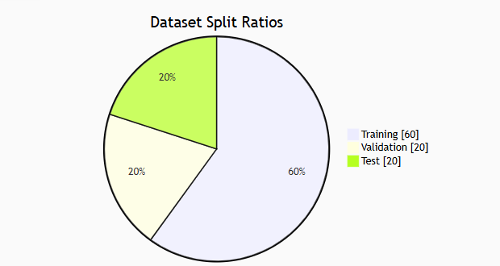

# Preprocessing

 To prepare the data for training a text classification model, we applied a series of Natural Language Processing preprocessing steps. These steps were implemented in Python using the NLTK library and were designed to reduce noise, standardize the text, remove unnecessary variation and convert raw language into embeddings (the real-valued vectors consumed by the LSTM).

### Preprocessing pipeline:
1.	Dataset Construction:
We combined Fake.csv and True.csv datasets into `Create_Dataset`, added binary labels (0 = fake, 1=real), removed empty entries, and shuffled the resulting dataset.

2.	Lowercasing and Data Cleaning:
In Preprocessing.py, all text was converted to lowercase. Special characters, punctuation, and non-alphabetic symbols were removed via regex. 
3.	Sentence and Word Tokenization:
Articles were split into individual sentences, and each sentence was further tokenized into words using NLTK's word_tokenize function.
4.	Stopword Removal:
Common English stopwords (e.g., "the", "and", "in") were removed to eliminate low-value words.
5.	Lemmatization:
Remaining words were lemmatized to reduce each word to its base form (e.g., "running" becomes "run").
6.	Special Tokens and Length Limitation:
We added an end of sentence token to each sentence. This helped the model recognize where sentences began and ended. After concatenating the title, subject and body tokens, each article was then condensed to a maximum length of 256  tokens. This was done to ensure that all inputs were the same length and to avoid exceeding memory constraints.
7.	Vocabulary Filtering:
We built a vocabulary from the cleaned tokens, keeping only tokens that occurred at least 3 times. Words not in the vocabulary were replaced with an `<unk>` (unknown) token.
8.	Padding:
All token sequences were padded so that every article was the same length. This was necessary for batch processing and consistent input dimensions for the LSTM.

We used NLTK for linguistic preprocessing (tokenization, stopword removal, and lemmatization) and PyTorch for vocabulary management and data batching.
In addition to these steps, we implemented efficient data storage. The final encoded dataset and vocabulary were saved as .pkl files in the Pickled_data folder to keep file sizes small and avoid exceeding GitHub's 100MB commit limit. Human-readable .txt files—containing the unprocessed text, vocabulary, and encoded sequences—were saved in a Readables folder, which is excluded from version control. These preprocessing steps not only standardized and cleaned the text but also contributed to noise reduction, dimensionality control (through a filtered vocabulary), and semantic consistency (via lemmatization). As a result, the model was able to train more efficiently and generalize better to unseen data.

## Data Splitting
The dataset was split using Pytorch into:
 - 60% training set – for model learning.
 - 20% validation set – for hyperparameter tuning and model selection.
 - 20% test set – for final performance evaluation.

 

