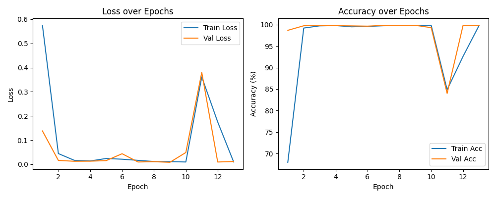

# Training and Validation

## Training Progress Curves

The above curves demonstrate optimal learning dynamics, with both training and validation loss decreasing rapidly and converging within the first few epochs, while accuracy metrics reached approximately 99% by epoch … and remained stable thereafter. The close alignment between training and validation performance throughout the training process indicates effective generalisation without overfitting, validating the model's ability to perform reliably on unseen data.