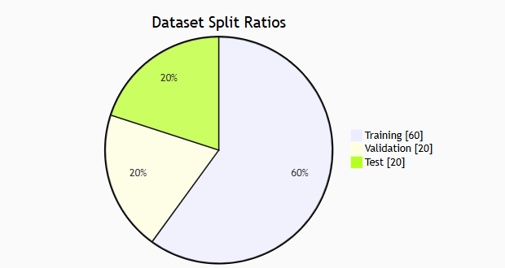
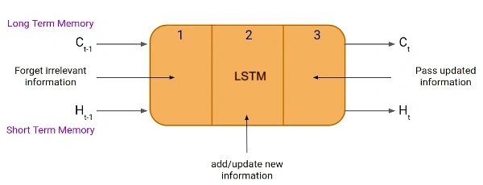
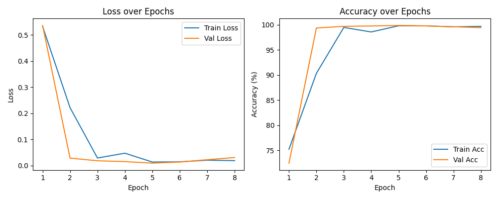
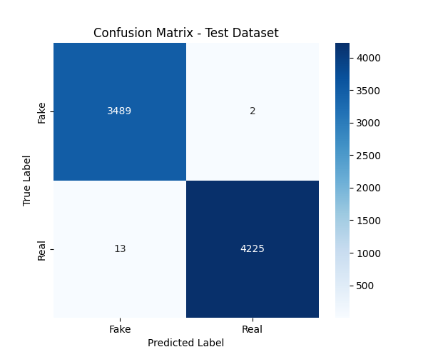
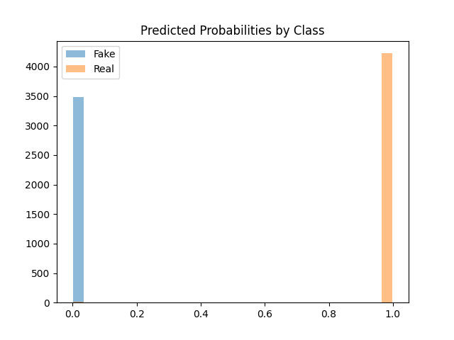
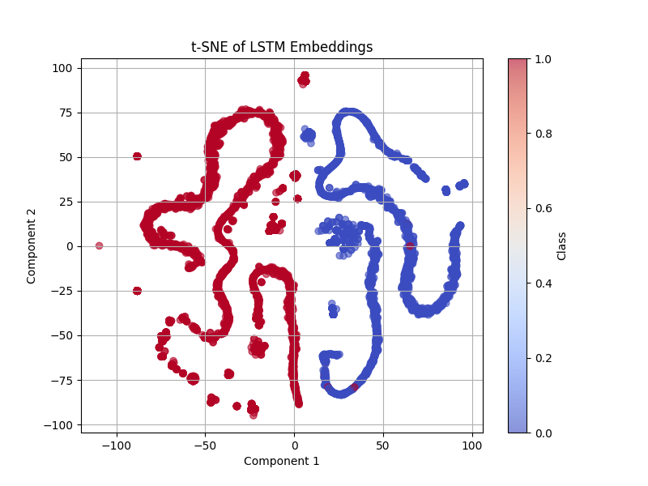

::: {.center}
{ width=100% }
:::


\begin{center}

\textbf{COMS4030A/7047A}

\vspace{0.5cm}

\textbf{Members:}

\begin{center}
\vspace{1.5cm}
Nashita Chowdhury (2554397)\\
Ariella Lewis (2596406)\\
Liam Brady (2596852)\\
Chloe Dube (2602515)
\end{center}


\end{center}


\newpage

\tableofcontents

\newpage


# Introduction

::: {.center}
{width=75%}
:::

In this project, we present a Long Short-Term Memory (LSTM) neural network to classify news articles as real or fake based on their textual content. LSTMs, a type of recurrent neural network (RNN), are particularly effective for sequential data tasks due to their ability to capture long range dependencies and contextual information within text. This makes them well-suited for natural language processing tasks such as fake news detection, where meaning often depends on the broader context of sentences and paragraphs.

Our dataset is made up of news articles published between March 31, 2015, and February 19, 2018, with a primary focus on American political content. The volume of articles increases around February 2016, coinciding with the onset of the U.S. presidential primaries, which means there was a likely increase in politically charged information, both real and fabricated.

This report outlines the architecture and implementation of the LSTM model, details the data preprocessing steps, and discusses the strategies used for hyperparameter tuning and model evaluation. Through this approach, we aim to develop a reliable and scalable method for classifying fake news articles using deep learning techniques.

\newpage

# The Dataset

## Fake News detection dataset
The dataset can be found at: https://www.kaggle.com/datasets/clmentbisaillon/fake-and-real-news-dataset/data .

There are two datasets included. We have `Fake.csv` and `True.csv` where the structure is as follows →

## Structure:
- Dataset separated in two files:

    - Fake.csv (23502 fake news article)
    - True.csv (21417 true news article)

- Dataset columns (features):

    - Title: title of news article
    - Text: body text of news article
    - Subject: subject of news article
    - Date: publish date of news article

The targets for the data are `Fake` and `Real`, thus the classification of the dataset is a binary text classification. To be able to work with the data appropriately, a file `Create_Dataset.py` merges the true and fake datasets and returns a merged and shuffled collection. This collection has the null values and duplicates removed, resulting in the following distribution:


There is a moderate class imbalance (~45.2% `Fake` vs ~54.84% `Real` news articles). Oversampling and reweighting proved unnecessary as the model performed well on both classes and the confusion matrix (discussed later) showed balanced errors.

\begin{figure}[H]
  \centering
  \includegraphics[width=0.6\textwidth]{media/image-1.png}
  \caption{Number of Fake News vs Real News}
  \label{fig:fake-vs-real}
\end{figure}

It was decided that only the body text of the news articles would be used in training the model. As seen below, the subject of the news articles made classification trivial as all the `Real` articles are classed as either `World News` or `Politics News` while the `Fake` articles had more variation - `US News`, `Middle East`, `Left News`, `Government News`, `Politics` and, simply, `News`. 

\begin{figure}[H]
  \centering
  \includegraphics[width=0.6\textwidth]{media/class.png}
  \caption{News subject categories by label}
  \label{fig:class-distribution}
\end{figure}

\begin{figure}[H]
  \centering
  \includegraphics[width=0.6\textwidth]{media/chart.png}
  \caption{Distribution of subject labels for Fake vs Real news}
  \label{fig:subject-distribution}
\end{figure}

\newpage

# Preprocessing

 To prepare the data for training a text classification model, we applied a series of Natural Language Processing preprocessing steps. These steps were implemented in Python using the NLTK library and were designed to reduce noise, standardize the text, remove unnecessary variation and convert raw language into embeddings (the real-valued vectors consumed by the LSTM).

## Data Splitting
**Before the vocabulary filtering, the dataset was split using SKlearn into:**
 - 60% training set – for model learning.
 - 20% validation set – for hyperparameter tuning and model selection.
 - 20% test set – for final performance evaluation.

 

## Preprocessing pipeline:
**1. Dataset Construction and Removing Duplicates:**

- Combined Fake.csv and True.csv datasets into `Create_Dataset`, added binary labels (`0` = fake, `1` = real).
- Removed rows with empty text and removed duplicate articles.
- Shuffled the resulting dataset.
- Originally, we had 44 898 articles, after removing 6 252 duplicates and 631 empty-text rows, we ended up with 38 646 articles.

**2. Lowercasing and Data Cleaning:**

In `Preprocessing.py`, all text was converted to lowercase. Special characters, punctuation, and non-alphabetic symbols were removed via regex. 

**3. Sentence and Word Tokenization:**

Articles were split into individual sentences, and each sentence was further tokenized into words using NLTK's `word_tokenize` function.

**4. Stopword Removal:**

Common English stopwords (e.g., "the", "and", "in") were removed to eliminate low-value words.

**5. Lemmatization:**

Remaining words were lemmatized to reduce each word to its base form (e.g., "running" becomes "run").

**6. Special Tokens:**

We added an end of sentence token `<eos>` to each sentence. This helped the model recognize where sentences began and ended - an important step in training the model to understand sentence structure and anchor the position of key information.

**7. Vocabulary Filtering:**

We built an enumerated vocabulary from the cleaned tokens, keeping only tokens that occurred at least 3 times in the training dataset. This ensures the model learns to generalise from known patterns on seen data and can successfully handle unseen data during validation and testing.

**8. Truncation and Padding:**

Each article was then condensed to a maximum length of 256 tokens. The beginning of a news article typically contains the most important content. LSTMs struggle with long sequences as they increase learning complexity, resulting in overfitting and making training noisier. All token sequences less than the maximum length were padded so that every article was the same length - necessity for batch processing and consistent input dimensions for the LSTM.

**9. Integer Encoding:**

LSTMs require numeric inputs that act as lookup keys for the embedding layer. The processed data was encoded as integer sequences using the vocabulary's enumeration. OOV (out-of-vocabulary) words were replaced with an `<unk>` (unknown) token.


We used NLTK for linguistic preprocessing (tokenization, stopword removal, and lemmatization)
In addition to these steps, we implemented efficient data storage. The final encoded dataset and vocabulary were saved as .pkl files in the Pickled_data folder to keep file sizes small and avoid exceeding GitHub's 100MB commit limit. Human-readable .txt files—containing the unprocessed text, vocabulary, and encoded sequences—were saved in a Readables folder, which is excluded from version control. These preprocessing steps not only standardized and cleaned the text but also contributed to noise reduction, dimensionality control (through a filtered vocabulary), and semantic consistency (via lemmatization). As a result, the model was able to train more efficiently and generalize better to unseen data.

\newpage


# Long Short Term Memory (LSTM)

## LSTM Defined
Long Short-Term Memory (LSTM) is a type of Recurrent Neural Network (RNN). LSTMs can capture long-term dependencies in sequential data making them ideal for tasks like language translation, speech recognition and time series forecasting (GeeksforGeeks, 2019).

LSTMs can hold memory for a significant amount of time so that it is possible for the model to learn any long-term dependencies. It does this via the use of a `hidden state` to keep a short-term memory of previous inputs as well as a `cell state` which keeps long-term memory of previous inputs.

The general structure is as follows: 

 (saxena, 2021)

- Part 1 (Forget Gate): chooses whether the information coming from the previous timestamp is to be remembered or is irrelevant and can be forgotten.
- Part 2 (Input Gate): the cell tries to learn new information from the input to this cell.
- Part 3 (Output Gate): the cell passes the updated information from the current timestamp to the next timestamp. 

This one cycle of LSTM is considered a single-time step.

The cell state will carry all the information about the data as well as the timestamps.

Finally the LSTM computations are done in the following way: 
Computation in a LSTM is done by first concatenating the current input `x(t)` with the previous short-term memory `h(t - 1)` to get `x(t)h(t - 1)` and then computing 

- Forget gate: f(t) = $\sigma$(x(t)h(t - 1)W<sub>f</sub> + b<sub>f</sub>)
- Input gate: i(t) =  $\sigma$(x(t)h(t - 1)W<sub>i</sub> + b<sub>i</sub>)
- Candidate memory: c(t) = tanh(x(t)h(t - 1)W<sub>c</sub>  + b<sub>c</sub> )
- Output gate: o(t) = $\sigma$(x(t)h(t - 1)W<sub>o</sub>  + b<sub>o</sub> )

The above vectors are then combined as follows:
- &tilde;c(t) = f(t)$\odot$&tilde;c(t - 1) + i(t)$\odot$c(t)
- h(t) = o(t)$\odot$tanh(&tilde;c(t))
where  represents pointwise multiplication of vectors


## Reasoning for choice of LSTM

RNNs are particularly effective at processing sequential data, such as language and text, due to their ability to capture temporal dependencies. This makes them more suitable for text analysis compared to other architectures like Convolutional Neural Networks (CNNs) or standard feedforward networks.
A key advantage of RNNs lies in their internal loop structures, which allow them to retain information across time steps—an essential feature for understanding context in sequential data. This capability enables RNNs to detect semantic patterns and relationships between words, which is critical in applications such as fake news detection.

LSTMs, an advanced form of RNNs, further enhance performance by mitigating the vanishing gradient problem. This allows the model to preserve and leverage important information from earlier in the sequence, improving classification accuracy, especially in longer texts. Additionally, LSTMs can handle input sequences of variable lengths, providing flexibility that static-length models lack.

Most machine learning models often rely on fixed-size input vectors and may fail to capture the nuanced dependencies that exist across time steps in a sequence. Whereas, Long Short-Term Memory (LSTM) networks are specifically designed to handle sequential data, making them appropriate for text classification tasks such as fake news detection.

The memory and gating features allow LSTMs to selectively retain or discard information over long sequences, enabling the model to learn both short-term and long-term dependencies within the text. This means that, LSTMs can understand context over multiple words and sentences which is an essential capability when dealing with politically based or convoluted language that often appears in fake news content.

Considering our dataset, we have the task of identifying whether excerpts of text can be classified as fake or genuine news articles. LSTMs are relevant in this case in that they have feedback connections, allowing them to process entire sequences of data, not just individual data points. This makes them highly effective in understanding and predicting patterns in sequential data like text and speech (saxena, 2021).

Given these strengths, building an LSTM model for the binary classification seemed an appropriate choice.


## Machine learning algorithm used

In this implementation, the machine learning algorithm used was a supervised learning approach with a stacked LSTM network. The model was trained using backpropagation through time (BPTT) with the Adam optimiser, and classification was guided by the Cross-Entropy Loss function. These methods enabled effective optimisation of the LSTM parameters for binary text classification. The entire model was trained on labelled fake and real news data, allowing it to learn and generalise patterns that distinguish between the two categories.


## LSTM Implementation

### Hyperparameters to consider: 

| Hyperparameter        | Value                            | 
| --------------------- | -------------------------------- | 
| **Max Seq Length**    | 256                              | 
| **LSTM Hidden Units**        | 128                              | 
| **Batch Size**        | 16                       | 
| **Learn Rate**           | 0.001                           |
| **Epochs**            | 15 - 20                           | 
| **Embedding Dimension** | 128                           | 
| **Optimizer**         | Adam                             | 
| **Loss**              | Binary Cross-Entropy             | 
| **No. of LSTM layers**| 2                                 |
| **Dropout**           | 0.5                               |
| **Weight Decay**           |  1e-5                             |


##### Further explanation

- **Max Seq Length**: The number of words, tokens, allowed in each input sample.
- **LSTM Hidden Units** :  The number of hidden state dimensions in each LSTM cell, how much memory each LSTM unit has. 
- **Batch Size** :  The number of training examples the model sees before updating weights.
- **Learn Rate**: A changing value that determines how much the model will tune its hyperparameters and the rate at which it will learn, it starts at 0.001, and will change as the model learns.
- **Epochs**: One full pass through the entire training dataset.   
- **Embedding dimension**: The size of the vector space each word is mapped into. 
    - The embedding layer converts words or phrases into a dense vector space, meaning that each word is represented as a vector of real numbers (Yadav, 2024).
- **Optimizer**: The algorithm used to update weights in the neural network during training.  
- **Loss**: The function the model tries to minimize, so it measures the difference between predicted and actual outputs.            
- **No. of LSTM layers**: How many LSTM layers are stacked, in our binary classification case it is better limited to 1.
- **Droput** - Dropout is a regularization method where input and recurrent connections to LSTM units are probabilistically excluded from activation and weight updates while training a network. This has the effect of reducing overfitting and improving model performance (Brownlee, 2017)
- **Weight Decay** - Also known as L2 Regularization, is used to regularize the weights by penalizing large weights in the network.


### Evaluation Metrics

- **Metrics**: Evaluation criteria during training and testing. E.g `accuracy` for training, `F1, precision, and recall` for evaluation.

| Metric      | Formula               | Purpose                  |
|-------------|-----------------------|--------------------------|
| **Accuracy**  | $$ \frac{TP + TN}{Total} $$| Measures overall prediction correctness |
| **Precision** | $$\frac{TP}{TP + FP}$$    | Controls false positives |
| **Recall**    | $$\frac{TP}{TP + FN}$$    | Controls false negatives |
| **F1-Score**  | $$2 \times \frac{P \times R}{P + R}$$ | Harmonic mean of precision and recall |

##### These values are used to compute the confusion matrix:
- **TP**: True Positives  
- **TN**: True Negatives  
- **FP**: False Positives  
- **FN**: False Negatives   


### General algorithm:

The general algorithm is as follows: 

```python
sequence_len = N

for i in range (0,sequence_len):
    
    # at initial step intialize h(t-1) and c(t-1) randomly
 
    if i==0:
        ht_1 = random ()
        ct_1 = random ()
       
    else: 
        ht_1 = h_t
        ct_1 = c_t
    
    f_t = sigmoid ( matrix_mul(Wf, xt) +matrix_mul(Uf, ht_1) +bf)
    i_t = sigmoid ( matrix_mul(Wi, xt) +matrix_mul(Ui, ht_1) +bi)
    o_t = sigmoid ( matrix_mul(Wo, xt) +matrix_mul(Uo, ht_1) +bo)
    cp_t = tanh   ( matrix_mul(Wc, xt) +matrix_mul(Uc, ht_1) +bc)

    c_t  = element_wise_mul(f_t, ct_1) + element_wise_mul(i_t, cp_t) 
    h_t  = element_wise_mul(o_t, tanh(c_t))

```

The next section will explore the Python libraries and frameworks used to implement the LSTM appropriately for the dataset.

\newpage


# Python Libraries, Frameworks and packages.

## Pytorch
The model and data pre-processing are implemented using `PyTorch` as an aspect, PyTorch is an open source machine learning (ML) framework based on the Python programming language and the Torch library (Yasar, 2022).

(Pytorch.org, 2024)

- `Create_Datasets.py`
    - Imported the function `random_split(...)` from `torch.utils.data`, this functon is used to randomly split the dataset into     non-overlapping new datasets of given lengths, namely into validation, test and training datasets.


- `LSTM.py`
    - Imported `torch.nn` as `nn` and used the following functions: 
        - `nn.Embedding(...)`
        - `nn.LSTM(...)`
        - `nn.Linear(...)`
    - `nn.Embedding(...)`, used to make vectors of the words/tokens from the articles, so the model can map words or tokens to learnable vector representations.
    - `nn.LSTM(...)`, initializes a multi-layer LSTM Long Short-Term Memory network to process the sequential data.
    - `nn.Linear(...)`, creates a linear layer to map the output of an LSTM or any hidden layer to the desired output size, typically the number of classes or target values.


- `Train.py`
    - Imported `torch`, `torch.nn` as `nn`, `import torch.optim as optim` and `torch.utils.data import DataLoader, TensorDataset`
    - `torch` used by...
    - `torch.nn` used `nn.CrossEntropyLoss()` to initialize a cross-entropy loss function.
    - `torch.optim` initliazes the optimizer... (subject to change)
    - `torch.utils.data` made use of `TensorDataset` creates a PyTorch TensorDataset, to wrap the torch.Tensor objects (inputs and labels) into a dataset so they can be accessed together one sample at a time, later the samples are to be loaded into `DataLoader`.


- To use PyTorch to make an LSTM model the following steps are taken:
    - `import torch`
    - `import torch.nn`
    

It is particulary relevant to our chosen `LSTM` model because PyTorch offers support for sequential models, such as LSTMs, with easy to use abstractions like `nn.LSTM`, dynamic computational graphs, and integration with GPU acceleration. These features make PyTorch well-suited for handling natural language data and efficiently training sequence models.

## Natural Language Toolkit (NLTK)

- Tokenization  
NLTK's tokenization functions were employed at two levels:  
    - **Sentence Tokenization**: `sent_tokenize()` splits documents into sentences  
    - **Word Tokenization**: `word_tokenize()` splits sentences into words  

- Stopword Removal  
    - Used NLTK's English stopwords list (`stopwords.words('english')`) to filter common words.

- Lemmatization  
    - NLTK's `WordNetLemmatizer` reduced words to their base forms (lemmas).

- NLTK Data Downloads  
    Downloaded these NLTK data packages:  
    - `stopwords`  
    - `wordnet` (for lemmatization)  
    - `punkt` (for tokenization)  

- Preprocessing Pipeline

#### Text Cleaning Steps  
1. **Case Normalization**: Convert text to lowercase  
2. **Special Character Removal**: Regex removes non-alphabetic chars  
3. **Stopword Removal**: Filters common stopwords  
4. **Lemmatization**: Reduces words to base forms  
5. **Special Tokens**: Adds `<eos>` markers  

- Vocabulary Construction  
    1. Built vocabulary from words appearing $\geq$ times (`MIN_VOCAB_FREQ`)  
    2. Included special tokens:  
    - `<pad>` (padding)  
    - `<eos>` (end-of-sentence)  
    - `<unk>` (unknown words)  

- Data Encoding  
    1. Encoded text using vocabulary indices  
    2. Handled unknown words with `<unk>`  
    3. Padded/truncated to fixed length (`MAX_ARTICLE_LEN`)

NLTK was critical in preparing the news dataset for training the LSTM model, which classifies articles as real or fake. Since LSTMs are sensitive to the structure and quality of input sequences, effective preprocessing ensures that the model learns meaningful patterns rather than noise.

Overall, this NLTK used in the preprocessing pipeline enhances the quality and consistency of the text data, enabling the LSTM model to better learn the linguistic and semantic patterns that differentiate the real news from fake news.


## Scikit-learn

Scikit-learn's module was integrated to evaluate the performance of an LSTM model for fake news classification.


- Performance Metrics

``` python
from sklearn.metrics import (
    accuracy_score,
    classification_report, 
    confusion_matrix
) 
```

- The dataset splitting strategy using scikit-learn `train_test_split` function to create training, validation, and test sets for model development.

```python
from sklearn.model_selection import train_test_split

def Split_Dataset(dataset):
    """Splits dataset into training (60%), validation (20%), and test (20%) sets
    
    Args:
        dataset: Pandas DataFrame containing text and label columns
        
    Returns:
        Tuple of (training_data, validation_data, test_data)
    """
    # First split: 60% training, 40% temp holdout
    training_data, temp_data = train_test_split(
        dataset, 
        test_size=0.4, 
        random_state=42, 
        stratify=dataset['label']
    )
    
    # Second split: 50/50 split of temp data → 20% validation, 20% test
    validation_data, test_data = train_test_split(
        temp_data, 
        test_size=0.5, 
        random_state=42, 
        stratify=temp_data['label']
    )
    
    return training_data, validation_data, test_data
    
```


##### Key Features

- Maintains original class distribution using stratify parameter which is important for imbalanced datasets.Ensures representative samples of both classes ('Fake'/'Real') in all splits.

- Reproducible Splits
    - Fixed `random_state=42` guarantees:

        - Same splits across different runs
        - Consistent model evaluation

Scikit-learn was used to support the evaluation and data preparation stages of the LSTM-based fake news classifier. Its `train_test_split` function enabled systematic splitting of the dataset into training (60%), validation (20%), and test (20%) sets. Importantly, the use of the `stratify` parameter preserved the original class distribution across all subsets, which is important when working with potentially imbalanced datasets like fake vs. real news.

In addition, setting a fixed `random_state` ensured reproducibility, enabling consistent model training and fair comparisons across experiments.

For performance evaluation, Scikit-learn's metric functions (`accuracy_score`, `classification_report`, `confusion_matrix`) provided an analysis of the model’s predictions. These metrics helped quantify not just overall accuracy, but also class-specific precision, recall, and F1-scores.

With Scikit-learn, the pipeline ensures reliable dataset handling and standardized evaluation, both of which are essential for developing trustworthy models in fake news detection tasks.

\newpage
<div class="page-break"></div>

# Hyperparameter tuning

Tuning was done manually. The hyperparameters were modified one at a time to test how well the model performed after each change. Evaluation of the model was conducted using validation accuracy and loss. Initially, it struggled to improve beyond a 55% validation accuracy - essentially random guessing for a binary text classification - and validation loss increased every epoch, indicating overfitting. The following hyperparameters made the greatest difference in solving these issues:


## Number of LSTM layers

Originally, our model utilised only one LSTM layer. This was increased to two layers to capture hierarchical patterns and dependencies, ultimately increasing accuracy. To avoid further overfitting, regularization was introduced via:

## Dropout

A fraction of the neurons in a layer are dropped out each forward pass so the model does not learn to rely on any one feature. We set this to 0.5.

## Weight decay

Equivalent to L2 regularization, we introduced a weight decay of 1e-5 to prevent the model from memorising training data and prevent exploding gradients.

## Batch size

The original batch size was 32 and was later decreased to 16 for better generalisation and frequent updates for the model to escape local minima more effectively.

## Maximum Article length

Shorter sequences (256 tokens) tend to focus on the core information and the beginning of news articles are typically the most important, whereas longer sequences (512 tokens) contain background and elaboration, providing more context but diluting the signal needed for classification and forcing the model to compress more information into a fixed size hidden state. Beyond a certain point, LSTMs do not scale well with longer sequence length, as we discovered during the initial runs with a maximum length of 512.


With outliers removed, the above plot shows the length of preprocessed articles before truncation, revealing that the second quartile contains 224 tokens. We changed the maximum article length to 256 and noticed a significant increase in accuracy and no overfitting.

\newpage
<div class="page-break"></div>

# Training and Validation

## Training Progress Curves



The above curves demonstrate optimal learning dynamics, with both training and validation loss decreasing rapidly and converging within the first few epochs, while accuracy metrics reached approximately 99% by epoch five and remained stable thereafter. Early stopping was implemented to stop training once the model stopped improving. The close alignment between training and validation performance throughout the training process indicates effective generalisation, validating the model's ability to perform reliably on unseen data.

## Confusion Matrix


The confusion matrix analysis, provided above, reveals only 45 misclassifications out of 7 729 test samples. This consists of 41 false positive (real news incorrectly classified as fake) and 4 false negatives (fake news incorrectly classified as real).

\newpage
<div class="page-break"></div>

# Results on Test Dataset

The trained LSTM model demonstrates exceptional performance on the test dataset, generally achieving a test accuracy greater than 99% with near-perfect precision and recall scores of 1.00 for both fake and real news categories.

## Confusion Matrix



The confusion matrix analysis, provided above, reveals only 15 misclassifications out of 7 729 test samples. This consists of 13 false positive (real news incorrectly classified as fake) and 2 false negatives (fake news incorrectly classified as real). This minimal error rate indicates that the model successfully learned to distinguish between authentic and fabricated news articles with great reliability. The balanced performance across both classes demonstrates that the LSTM architecture effectively captured the distinctive linguistic and structural patterns present in each category without exhibiting bias toward either class.

## Predicted Probability Distribution Visualisation



This reveals the model's exceptional confidence in its classifications, with most predictions clustering near the extreme values of 0.0 for fake news and 1.0 for real news. This bimodal distribution pattern indicates strong decision boundaries and minimal uncertainty in the model's predictions, with very few samples falling into the ambiguous middle range between 0.2 and 0.8. Such clear probability separation suggests that the LSTM successfully identified features that enable confident classification decisions. 

## t-SNE Visualisation



The t-SNE visualisation of LSTM embeddings provides compelling evidence of the model's feature learning capabilities, displaying clear cluster separation between fake and real news articles in the reduced-dimensional space. The distinct groupings with close to no overlap between classes (1 for real news, 0 for fake news) demonstrates that the LSTM network successfully learned meaningful semantic representations, capturing the differences between authentic and fake news content. This separation in the embedding space reflects the model's ability to extract relevant linguistic patterns and structural characteristics that distinguish the two categories. The clear clustering within each class further indicates that the model identified consistent patterns across similar article types, enabling robust classification performance. 

These results show that the LSTM model is capable of processing text data effectively and easily separates real and fake news through pattern recognition and sequential feature extraction, using its memory mechanisms to capture linguistic dependencies and contextual relationships that distinguish authentic news from fabricated content.

\newpage
<div class="page-break"></div>

# Conclusion 

In this project, we developed an LSTM-based binary text classifier to distinguish fake news from real news.

The articles were preprocessed via tokenization, stopword removal and lemmatization. Based on the dataset’s median length, the articles were truncated to a maximum of 256 tokens. This limitation improved performance by reducing noise and overfitting while preserving the most informative content in the news articles. 

Using a vocabulary derived from only the training set, the model was able to generalise efficiently, successfully understanding OOV words once tested on the validation and test datasets. The model architecture included a two-layer LSTM with 128 hidden units and a fully connected layer for binary classification. Regularization was applied using dropout, and weight decay.

Our model achieved near-perfect performance on both validation and test datassets, with an overall test accuracy of 99.93% and an F1 score of 1.00 for both classes. These results suggest the model successfully captured the linguistic and structural patterns distinguishing fake from real news.

\newpage
<div class="page-break"></div>

# References

1. Yasar, K. (2022). PyTorch. [online] SearchEnterpriseAI. Available at: https://www.techtarget.com/searchenterpriseai/definition/PyTorch.
2. GeeksforGeeks (2019). Deep Learning | Introduction to Long Short Term Memory. [online] GeeksforGeeks. Available at: https://www.geeksforgeeks.org/deep-learning-introduction-to-long-short-term-memory/.
3. saxena, S. (2021). LSTM | Introduction to LSTM | Long Short Term Memor. [online] Analytics Vidhya. Available at: https://www.analyticsvidhya.com/blog/2021/03/introduction-to-long-short-term-memory-lstm/.
4. Yadav, A. (2024). Embedding Layer in Deep Learning - Biased-Algorithms - Medium. [online] Medium. Available at: https://medium.com/biased-algorithms/embedding-layer-in-deep-learning-250a9bf07212 [Accessed 15 May 2025].
5. Pytorch.org. (2024). PyTorch documentation — PyTorch 2.7 documentation. [online] Available at: https://docs.pytorch.org/docs/stable/index.html.
6. Brownlee, J. (2017). How to Use Dropout with LSTM Networks for Time Series Forecasting. [online] Machine Learning Mastery. Available at: https://machinelearningmastery.com/use-dropout-lstm-networks-time-series-forecasting/.
<div class="page-break"></div>