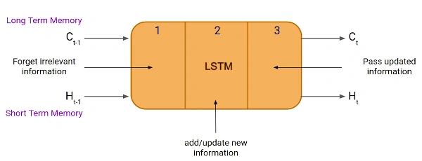

# Long Short Term Memory (LSTM)

## LSTM Defined
Long Short-Term Memory (LSTM) is a type of Recurrent Neural Network (RNN). LSTMs can capture long-term dependencies in sequential data making them ideal for tasks like language translation, speech recognition and time series forecasting (GeeksforGeeks, 2019).

LSTMs can hold memory for a significant amount of time so that it is possible for the model to learn any long-term dependencies. It does this via the use of a `hidden state` to keep a short-term memory of previous inputs as well as a `cell state` which keeps long-term memory of previous inputs.

The general structure is as follows: 

 (saxena, 2021)

- Part 1 (Forget Gate): chooses whether the information coming from the previous timestamp is to be remembered or is irrelevant and can be forgotten.
- Part 2 (Input Gate): the cell tries to learn new information from the input to this cell.
- Part 3 (Output Gate): the cell passes the updated information from the current timestamp to the next timestamp. 

This one cycle of LSTM is considered a single-time step.

The cell state will carry all the information about the data as well as the timestamps.

Finally the LSTM computations are done in the following way: 
Computation in a LSTM is done by first concatenating the current input `x(t)` with the previous short-term memory `h(t − 1)` to get `x(t)h(t − 1)` and then computing 

- Forget gate: f(t) = σ(x(t)h(t − 1)W<sub>f</sub> + b<sub>f</sub>)
- Input gate: i(t) =  σ(x(t)h(t − 1)W<sub>i</sub> + b<sub>i</sub>)
- Candidate memory: c(t) = tanh(x(t)h(t − 1)W<sub>c</sub>  + b<sub>c</sub> )
- Output gate: o(t) = σ(x(t)h(t − 1)W<sub>o</sub>  + b<sub>o</sub> )

The above vectors are then combined as follows:
- &tilde;c(t) = f(t)⊙&tilde;c(t − 1) + i(t)⊙c(t)
- h(t) = o(t)⊙tanh(&tilde;c(t))
where  represents pointwise multiplication of vectors


## Reasoning for choice of LSTM

Most machine learning models often rely on fixed-size input vectors and may fail to capture the nuanced dependencies that exist across time steps in a sequence. Whereas, Long Short-Term Memory (LSTM) networks are specifically designed to handle sequential data, making them appropriate for text classification tasks such as fake news detection.

The memory and gating features allow LSTMs to selectively retain or discard information over long sequences, enabling the model to learn both short-term and long-term dependencies within the text. This means that, LSTMs can understand context over multiple words and sentences which is an essential capability when dealing with politically based or convoluted language that often appears in fake news content.

Considering our dataset, we have the task of identifying whether excerpts of text can be classified as fake or genuine news articles. LSTMs are relevant in this case in that they have feedback connections, allowing them to process entire sequences of data, not just individual data points. This makes them highly effective in understanding and predicting patterns in sequential data like text and speech (saxena, 2021).

Given these strengths, building an LSTM model for the binary classification seemed an appropriate choice.


## LSTM Implementation

### Hyperparameters to consider: 

| Hyperparameter        | Value                            | 
| --------------------- | -------------------------------- | 
| **Max Seq Length**    | 256                              | 
| **LSTM Hidden Units**        | 128                              | 
| **Batch Size**        | 16                       | 
| **Learn Rate**           | 0.001                           |
| **Epochs**            | 15 - 20                           | 
| **Embedding Dimension** | 128                           | 
| **Optimizer**         | Adam                             | 
| **Loss**              | Binary Cross-Entropy             | 
| **No. of LSTM layers**| 2                                 |
| **Dropout**           | 0.5                               |
| **Weight Decay**           |  1e-5                             |


##### Further explanation

- **Max Seq Length**: The number of words, tokens, allowed in each input sample.
- **LSTM Hidden Units** :  The number of hidden state dimensions in each LSTM cell, how much memory each LSTM unit has. 
- **Batch Size** :  The number of training examples the model sees before updating weights.
- **Learn Rate**: 
- **Epochs**: One full pass through the entire training dataset.   
- **Embedding dimension**: The size of the vector space each word is mapped into. 
    - The embedding layer converts words or phrases into a dense vector space, meaning that each word is represented as a vector of real numbers (Yadav, 2024).
- **Optimizer**: The algorithm used to update weights in the neural network during training.  
- **Loss**: The function the model tries to minimize, so it measures the difference between predicted and actual outputs.            
- **No. of LSTM layers**: How many LSTM layers are stacked, in our binary classification case it is better limited to 1.
- **Droput** - 
- **Weight Decay** - 

### Evaluation Metrics

- **Metrics**: Evaluation criteria during training and testing. E.g `accuracy` for training, `F1, precision, and recall` for evaluation.

| Metric      | Formula               | Purpose                  |
|-------------|-----------------------|--------------------------|
| **Accuracy**  | $ \frac{TP + TN}{Total} $| Measures overall prediction correctness |
| **Precision** | $\frac{TP}{TP + FP}$    | Controls false positives |
| **Recall**    | $\frac{TP}{TP + FN}$    | Controls false negatives |
| **F1-Score**  | $2 \times \frac{P \times R}{P + R}$ | Harmonic mean of precision and recall |

##### These values are used to compute the confusion matrix:
- **TP**: True Positives  
- **TN**: True Negatives  
- **FP**: False Positives  
- **FN**: False Negatives   


### General algorithm:

The general algorithm is as follows: 

```python
sequence_len = N

for i in range (0,sequence_len):
    
    # at initial step intialize h(t-1) and c(t-1) randomly
 
    if i==0:
        ht_1 = random ()
        ct_1 = random ()
       
    else: 
        ht_1 = h_t
        ct_1 = c_t
    
    f_t = sigmoid ( matrix_mul(Wf, xt) +matrix_mul(Uf, ht_1) +bf)
    i_t = sigmoid ( matrix_mul(Wi, xt) +matrix_mul(Ui, ht_1) +bi)
    o_t = sigmoid ( matrix_mul(Wo, xt) +matrix_mul(Uo, ht_1) +bo)
    cp_t = tanh   ( matrix_mul(Wc, xt) +matrix_mul(Uc, ht_1) +bc)

    c_t  = element_wise_mul(f_t, ct_1) + element_wise_mul(i_t, cp_t) 
    h_t  = element_wise_mul(o_t, tanh(c_t))

```

The next section will explore the Python libraries and frameworks used to implement the LSTM appropriately for the dataset.

