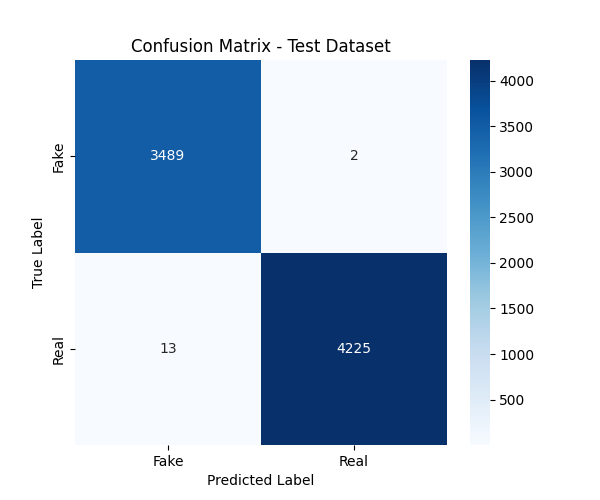
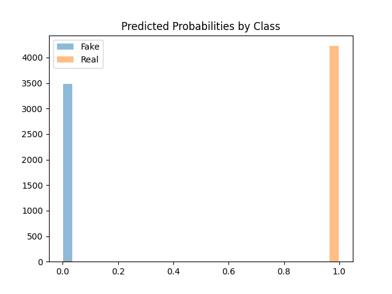
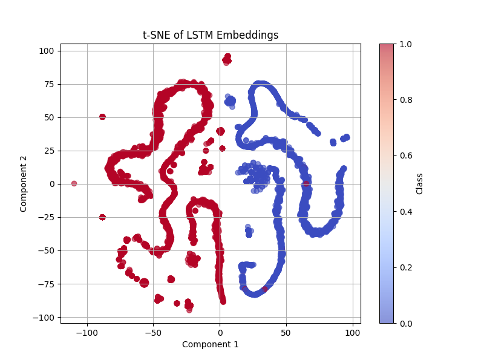

# Results on Test Dataset

The trained LSTM model demonstrates exceptional performance on the test dataset, generally achieving a test accuracy greater than 99% with near-perfect precision and recall scores of 1.00 for both fake and real news categories.

## Confusion Matrix

The confusion matrix analysis, provided above, reveals only 15 misclassifications out of 7 729 test samples. This consists of 13 false positive (real news incorrectly classified as fake) and 2 false negatives (fake news incorrectly classified as real). This minimal error rate indicates that the model successfully learned to distinguish between authentic and fabricated news articles with great reliability. The balanced performance across both classes demonstrates that the LSTM architecture effectively captured the distinctive linguistic and structural patterns present in each category without exhibiting bias toward either class.

## Predicted Probability Distribution Visualisation

This reveals the model's exceptional confidence in its classifications, with most predictions clustering near the extreme values of 0.0 for fake news and 1.0 for real news. This bimodal distribution pattern indicates strong decision boundaries and minimal uncertainty in the model's predictions, with very few samples falling into the ambiguous middle range between 0.2 and 0.8. Such clear probability separation suggests that the LSTM successfully identified features that enable confident classification decisions. 

## t-SNE Visualisation

The t-SNE visualisation of LSTM embeddings provides compelling evidence of the model's feature learning capabilities, displaying clear cluster separation between fake and real news articles in the reduced-dimensional space. The distinct groupings with close to no overlap between classes (1 for real news, 0 for fake news) demonstrates that the LSTM network successfully learned meaningful semantic representations, capturing the differences between authentic and fake news content. This separation in the embedding space reflects the model's ability to extract relevant linguistic patterns and structural characteristics that distinguish the two categories. The clear clustering within each class further indicates that the model identified consistent patterns across similar article types, enabling robust classification performance. 

These results show that the LSTM model is capable of processing text data effectively and easily separates real and fake news through pattern recognition and sequential feature extraction, using its memory mechanisms to capture linguistic dependencies and contextual relationships that distinguish authentic news from fabricated content.