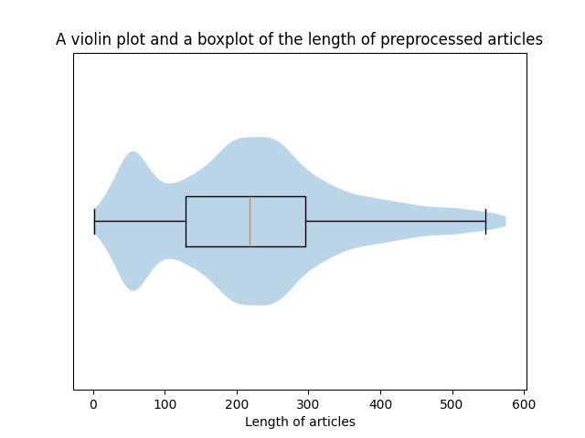

# Hyperparameter tuning

Tuning was done manually. The hyperparameters were modified one at a time to test how well the model performed after each change. Evaluation of the model was conducted using validation accuracy and loss. Initially, it struggled to improve beyond a 55% validation accuracy - essentially random guessing for a binary text classification - and validation loss increased every epoch, indicating overfitting. The following hyperparameters made the greatest difference in solving these issues:

## Number of LSTM layers

Originally, our model utilised only one LSTM layer. This was increased to two layers to capture hierarchical patterns and dependencies, ultimately increasing accuracy. To avoid further overfitting, regularization was introduced via:

### Dropout

A fraction of the neurons in a layer are dropped out each forward pass so the model does not learn to rely on any one feature. We set this to 0.5.

### Weight decay

Equivalent to L2 regularization, we introduced weight decay to prevent the model from memorising training data and prevent exploding gradients.

## Batch size

The original batch size was 32 and was later decreased to 16 for better generalisation and frequent updates for the model to escape local minima more effectively.

## LSTM Hidden Units

The original hidden size was 256 units and was later decreased to 128.

## Maximum Article length

Shorter sequences (256 tokens) tend to focus on the core information and the beginning of news articles are typically the most important, whereas longer sequences (512 tokens) contain background and elaboration, providing more context but diluting the signal needed for classification and forcing the model to compress more information into a fixed size hidden state. Beyond a certain point, LSTMs do not scale well with longer sequence length, as we discovered during the initial runs with a maximum length of 512.

With outliers removed, the above plot shows the length of preprocessed articles before truncation, revealing that the second quartile contains 224 tokens. We changed the maximum article length to 256 and noticed a significant increase in accuracy and no overfitting.